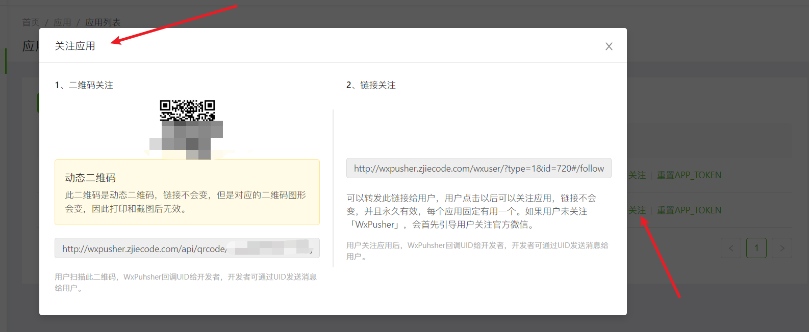
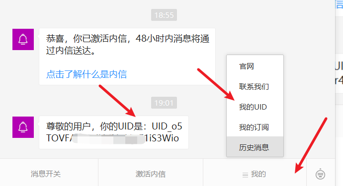
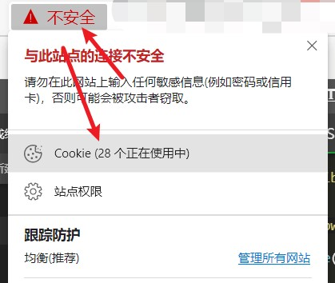
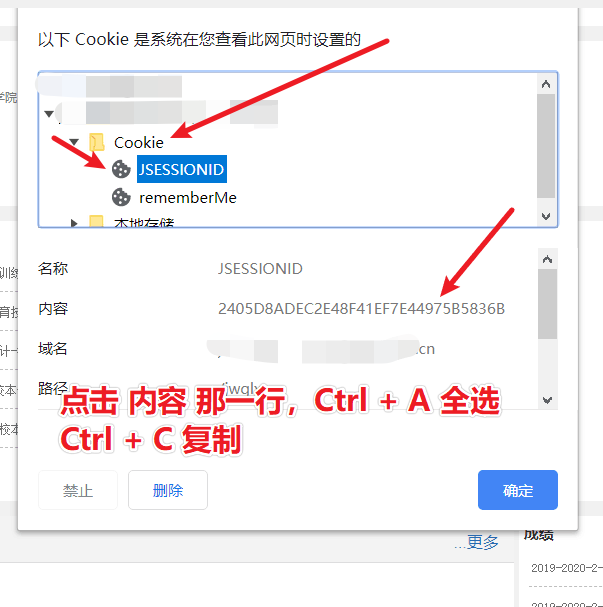

# zhengfang-results-push
新版正方教务系统 期末成绩主动推送至微信等

# 配置方法
1. 配置 `functions.php` 第10行、16行、21行，里面有详细的注释说明
2. 配置 `config.php` 第14行，请看下方的 *关于 WxPusher 的使用*

# 关于 WxPusher 的使用
1. 请前往 [http://wxpusher.zjiecode.com/admin/app/list](http://wxpusher.zjiecode.com/admin/app/list) 新建一个应用
    > 没有注册账号先根据提示注册账号
    >
    > 除了带有 `*` 标记的表单需要填写，其它都不需要填。傻瓜式填写，不多讲述
2.  新建完应用你会获得一个 **APP_TOKEN** 复制它，将它填到 `config.php` 第14行
3. 然后不出意外会弹出一个二维码的模态框（如果没有，点击对应 应用的 **关注** 即可出现）
    
4. 扫码关注公众号（这个二维码可以保存下来）
5. 然后点击下方的 我的 -> 我的UID 获取UID，格式是 `UID_xxxxxxxxx`
    
    
# 获取教务系统 JSESSIONID
1. 打开教务系统
2. 点击如图

    
3. 复制 SESSION
    

# 使用方法
1. 首次查询成绩并推送（第一次添加或更新 JSESSIONID 时用这种方法）
    1. 命令行方法，执行 `php main.php -U "你的UID" -S "获取的 JSESSIONID"`
    2. 网页方法，访问 `http://你的域名/main.php?UID=你的UID&JSESSIONID=获取的SESSION`

2. 定时执行监听，因为已经缓存了 JSESSIONID，所以不需要传 JSESSIONID 参数
    > 我们学校教务系统大概每2分钟执行一次，JSESSIONID 就不会失效，你们的具体情况具体更改、
    1. 命令行方法，执行 `php main.php -U "你的UID"`
    2. 网页方法，访问 `http://你的域名/main.php?UID=你的UID`

[http://wxpusher.zjiecode.com/admin/app/list]: http://wxpusher.zjiecode.com/admin/app/list